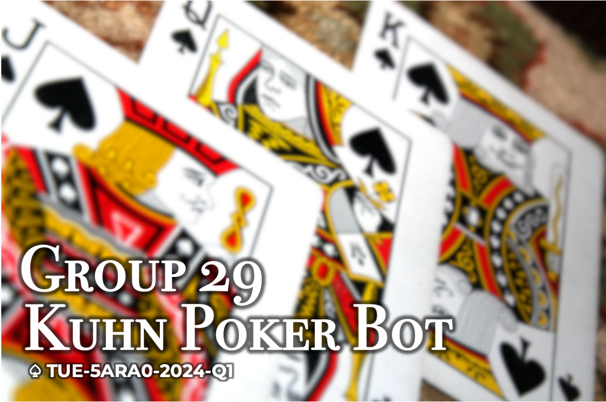
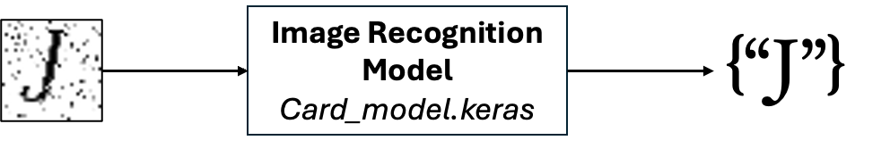

## Table of Contents
- [Introduction](#introduction)
- [Getting Started](#getting-started)
  - [Prerequisites](#prerequisites)
  - [Installation](#installation)
- [Architecture](#architecture)
  - [Data Structure](#data-structure)
  - [Image Recognition Model](#image-recognition-model)
  - [Betting Strategy](#betting-strategy)
- [Usage](#usage)
  - [Running the Bot](#running-the-bot)
  - [Game Variations](#game-variations)
- [Contributing](#contributing)
- [License](#license)
- [Acknowledgments](#acknowledgments)

## Introduction
The Kuhn Poker Bot is an AI-powered tool designed to play Kuhn poker. It utilizes an image recognition model to detect the cards dealt to the player and implements sophisticated betting strategies based on the number of cards in play (three and four card betting strategies).

## Getting Started

### Prerequisites
Before running the Kuhn Poker Bot, ensure you have the following software installed:
- Python 3.9
- TensorFlow
- DCV
- For a a list of dependencies: [Windows](environment.yml), [Linux](environment_linux.yml)

### Installation
1. Clone the repository:
   ```bash
   git clone https://github.com/tue-5ARA0-2024-Q1/pokerbot-pokerbot-29.git
   cd kuhn-poker-bot
   ```

2. Creata a new Conda environment and Install the required dependencies (choose environment file based on your OS):
    ```bash
    conda env create -f environment.yml
    ```

## Architecture
In this section we go through architecture and design choices we made througout the development process.

### Image Normalization
The `normalize_image` function transforms the pixel values of an input image into a normalized 2D matrix with values between 0 and 1. This process first converts the image into a NumPy array and then normalizes pixel values by dividing by 255 to ensure consistent results across images, which the model can then use for card rank prediction.

### Loading the dataset
The `load_data_set` function loads images, normalizes them using `normalize_image`, and extracts labels from the filenames. It then applies a train-validation split as per the provided ratio, returning both image arrays and label matrices.

### Generating the dataset
The dataset is generated using predefined card ranks (`J, ``Q, ``K) with noise levels and slight rotations added to each image for variety. Using ``generate_data_set`, images are randomly rotated by up to 15 degrees and assigned a noise level ranging from 0 to 1. Generated images are labeled and saved.

Each image is saved in the appropriate `training_images` or `test_images` directory. This approach allows for batch generation, provided the number of samples is given.


### Image Recognition Model
<!-- Sadra is responsible for this part -->
The bot employs an image recognition model built using TensorFlow to analyze the visual representation of the poker cards. The model processes images captured from the poker table to accurately identify which cards have been dealt.


#### DVC: Dataset and Model Version Control
We're using DVC and a bucket running on Amazon Web Service (AWS) as storage at the following address: 
`https://pokerbot-29-dvc.s3.eu-north-1.amazonaws.com`

To access the models stored while training, you have the run the following commands: 
```bash
conda install -c conda-forge awscli
conda install -c conda-forge dvc
aws configure
	-> key id : <ask-for-a-key-ID>
	-> secret key: <ask-for-a-secret-key>
	-> region: eu-north-1
	-> format: json
dvc remote add -d s3remote s3://pokerbot-29-dvc
dvc remote modify s3remote endpointurl https://s3.eu-north-1.amazonaws.com
```

### Kuhn Poker Strategy
In our poker agent implementation, we focus on maximizing the expected payoff based on the card dealt and the current game state. The game of Kuhn Poker revolves around three cards—Jack (`J), Queen (Q), and King (K)—with ``K` being the highest-ranked card and `J` being the lowest. However, simply holding a higher card doesn't guarantee a win; the key to a successful strategy lies in predicting the opponent’s behavior and adjusting actions accordingly.

Our strategy divides the agent’s behavior into two distinct roles: Initial Player (starting the round) and Responding Player (reacting to the initial player’s action). Each role uses different sets of probabilities depending on the player's card and the available moves.

#### Initial Player Strategy
When acting as the Initial Player, the agent’s first action depends on whether a previous move has been made in the round:

First Move: If the game just started (no previous moves), the agent must choose between `CHECK` or `BET. The probabilities for this decision are based on the card held (J, ``Q, or ``K). For instance, with a ``J, the agent is more likely to ``CHECK` defensively, while a `K` increases the likelihood of betting.

Next Move: If a betting action has already occurred, the agent evaluates whether to `CALL` or `FOLD, again based on the card held. For example, a ``K` is more likely to `CALL` as it is the highest-ranked card.

#### Responding Player Strategy
When the agent is the Responding Player, the strategy hinges on how the Initial Player acted:

Initial Player Checked: The agent now chooses whether to `CHECK` or `BET. The decision weights vary by card. For example, a ``Q` is highly likely to `CHECK`.

Initial Player Bet: The agent must decide whether to `CALL` or `FOLD. As with the Initial Player, the agent's choice is informed by the card it holds. A ``K` will always `CALL, while a ``J` is more inclined to `FOLD`.

### Probabilistic Approach
Each decision made by the agent is driven by assigned probabilities tailored to the specific card held. These probabilities are adjusted randomly to introduce some level of unpredictability, ensuring the agent is not easily predictable across rounds.

For example, the following probabilities are assigned for the Initial Player when deciding whether to `CHECK` or `BET` on the first move:

`J`: $[1 - \alpha, \alpha]$ 
`K`: $[1 - 3\alpha, \alpha]$ 
`Q`: $[1, 0]$ 
Similarly, for the third move, when deciding between `CALL` and `FOLD` the probabilities shift depending on the card.

For the Initial Player's next move after the Responding Player's move, when deciding whether to `CALL` or `FOLD`, the probabilities shift depending on the strength of the card. This decision is triggered after the first player has already made an action and is now facing the decision to call or fold.

`J`: $[0, 1]$ 
`K`: $[1, 0]$ 
`Q`: $[1/3 + \alpha, 2/3 - \alpha]$ 

The above reflects that holding a `J` is always going to lead to a fold, whereas `K` are always called, and `Q` are also more likely to fold but still have some chance of calling based on the randomness introduced by $\alpha$.

Then, for the Responding Player: they can react to the first player's decision, where no bets have been placed, and the opponent has checked. The responding player must now decide whether to CHECK or BET. Again, the card held by the agent influences this decision.

`J`: $[2/3, 1/3]$ 
`K`: $[0, 1]$ 
`Q`: $[1, 0]$ 

In this scenario, `Q` is always going to check, while `J` are more likely to check. `K`, on the other hand, always bet.

In the other case, the Responding Player is facing a bet from the first player and must now decide whether to CALL or FOLD.

`J`: $[0, 1]$ 
`K`: $[1, 0]$ 
`Q`: $[1/3, 2/3]$ 

The `J` will always fold when facing a bet. `K` will always call and `Q` are also more likely to fold but may occasionally call.

### Agent Implementation
The agent’s strategy is implemented in two main functions:

`InitialPlayerStrategy`: Determines the action for the player who starts the round, taking into account whether any moves have been made and the card held.

`RespondingPlayerStrategy`: Determines the action for the player who responds to the Initial Player, based on the available actions and the card.

These functions are invoked by the `make_action` method, which first identifies the player’s turn order and then selects the appropriate strategy. The state of the game and round (including the current card and available actions) are passed into these strategies to make a decision.

## Usage

### Running the Bot
 we won't go into details of how to run this spot as the details have already been discussed [here](README.md). Please follow the instructions. To put it briefly, You can play an online game with our client against a bot by running the following command:

```bash
python main.py --token <token UUID here> --play "bot" --global
```

### Game Variations
You can define a `--cards` argument to play a 4-card Kuhn Poker, instead of a regular 3-card game. In case not specified, the bot will default to play a 3-card game. Please refer to [Betting Strategy](#betting-strategy) to better understand how each betting strategy work.

```bash
python main.py --token <token UUID here> --play "bot" --cards "4" --global
```

## Contributing
We welcome contributions from the community! If you would like to contribute, please follow these steps:

1. Fork the repository.
2. Create a new branch (`git checkout -b feature/YourFeature`).
3. ake your changes and commit them (`git commit -m 'Add new feature'`).
4. Push to the branch (git push origin feature/YourFeature).
5. Open a Pull Request and assign either of us for a review.

## License
This project is licensed under the MIT License - see the [LICENSE](LICENSE.md) file for details.

## References
https://en.wikipedia.org/wiki/Kuhn_poker - Check optimal strategy section
## Acknowledgments
+ Thanks to the instructors for their valuable feedback and improvements to this project.
+ Special thanks to the developers of the libraries used in this project: TensorFlow, Pytest, and others.