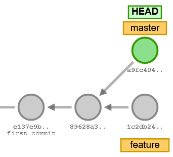

# Git and GitHub Tutorial (Week 1)

This week you'll become familiar with Git and GitHub. Git allows you to version text-based files, and share changes with your collaborators. Before you start the tutorial, you will need to have Git and GitHub properly setup. If not, please follow the getting started guide under the 5ARA0 GitHub organization. 

We'll walk through the basic process of cloning a repository, committing changes, pushing to a remote, and issuing pull requests. Constult the video lecture and the [git documentation](https://git-scm.com/docs) for details on the required commands.

## Cloning a Project

Accept the assignment invitation from GitHub Classroom. This creates a new personal remote repository with the skeleton code for the GitTutorial project. In your browser, navigate to the newly created project GitHub page. Each repository as hosted by GitHub has a unique remote address. You can find the remote address under the green `Code` button.

This address can be copied used to clone the repository to your local machine. On your machine, open a new terminal in VSCode and `git clone` the project to the desired folder.

## Branching and Committing

As a first step, you should become comfortable with thinking in terms of Git trees. There are numerous Git simulators on the internet that allow you to practice your skills.

Navigate to [this Git simulator](https://git-school.github.io/visualizing-git/#free) and re-create the branching structure below, using `git` commands. You can restart the simulation using the `clear` command. Make a screenshot of your tree _including the commands_ you used to obtain your tree, and save the screenshot for later.  

## Commit Messages

Upon a `git commit`, you have the option to specify a short commit message using the `-m` flag. A commit message describes the contents of your contribution. A commit message should be short (a few words to at most a sentence) and to-the-point. Throughout the course, mind the following points when writing commit messages:

- Avoid referring to the "assignments" in your commit messages, describe the actual contents of your contribution instead.
-  Use active phrasing, e.g. "fix bug in feature selection" instead of "fixed bug in feature selection". This way, the logs (`git log`) will read like a recipe that describes the process of development.
- If you find yourself writing a commit message that involves "and", e.g. "fix bug in feature selection and add regression test", this indicates that this commit should have been two separate commits - i.e. "fix bug in feature selection" and "add regression test for feature selection".

## Ignoring Files

In the folder where you cloned the project, you will find a `.gitignore` file. This file specifies any files or folders that should not be tracked by Git.

First and foremost, files that contain any secret keys or tokens relating to your project should be included in the `.gitignore` _before_ any commits are made. Committing keys or tokens to Git leaves you vulnerable to serious security exploits. For example, an attacker might use your secret token to gain access to your database, or contract hosted services in your name.

Secondly, binary files are often included in the `.gitignore`. Small changes in your code base may lead to big changes in binary files (for example, your compiled executables). Git is designed for tracking text-based changes, so you'll want to include any large or frequently-changing binaries in the `.gitignore`. 

> ### Assignment 1.1
> Add a line to the `.gitignore` that excludes _all_ files that start with `token`. Furthermore, exclude all pickle (`pkl`) files, _except_ those in the `test` directory. Track your changes and commit them with a suitable commit message. Then push your commit to GitHub. Open your project's GitHub page in the browser and verify that your contributions have been pushed to the remote.

## A Basic Git Workflow

Before starting work on any new functionality, it is good practice to first split off a branch from the `main`. Let's start writing some (mockup) documentation for our project.

> ### Assignment 1.2
> Start a new `docs` branch, and switch your `HEAD` to this branch. Start a new `documentation.md` file and make some (arbitrary) textual edits. Track your changes, commit (always with a suitable message), and push them to a _new_ remote `docs` branch. Hint: Consult the documentation on how to push to a new remote branch.

## Merging Changes through a Pull Request

The remote `docs` branch (with your included changes) is now also available to any of your collaborators. On the GitHub page, you should now see the `docs` branch appear among your branches.

Once you're satisfied with your work, you may wish to merge your changes in the `main` branch. We could do this locally (as shown in the lecture). However, this time we will merge our changes through a pull request on GitHub. With a pull request, you issue a request to your collaborators to merge your work (the `docs` branch). You can then discuss your contribution with the others online, and they may request changes if needed.

> ### Assignment 1.3
> On Github, open the "Pull requests" tab and start a new pull request to merge the `docs` branch into the `main` branch. Specify a descriptive title for the pull request (without referring to the "assignment") and a brief description that summarizes the contents of your contribution. Then create and merge the pull request on Github.

In your local terminal, switch your `HEAD` to the `main` branch and pull the updated `main` branch from GitHub. Verify that your updated documentation is now available in the `main` branch. You can then delete the local `docs` branch.

Note that the `docs` branch is deleted locally, but that it is still open on the remote (GitHub). You can leave the remote branch open for now.

## GitHub Issues

On the GitHub project page you also have the option to open "issues". GitHub issues are an important feature when communicating between remote teams. If your project is public, any GitHub user can submit issues to report bugs and feature requests.

> ### Assignment 1.4
> Navigate to the GitHub issues page of your project and start a new issue. In the description, include the screenshot of the Git tree that you made earlier and specify an informative title (again, without reference to the "assignment"). Then submit the issue.

## Git for Software Development

Documentation is an important aspect of any software project. Code _comments_ and _docstrings_ are a part of your documentation and are indispensible to your fellow developers (and your future self). 

A good comment concisely motivates a non-trivial line/block of code in natural language. The level of detail of your comments should be such that your peers (fellow students in this case) can easily understand your code (no more, no less).

A docstrings motivates a larger unit of code, such as a class, module or function. It also specifies the text that is returned by the Python `help()` function. A good docstring for a function includes a short summary, an overview of input arguments, and a description of the returned value. 

> ### Assignment 1.5
> In `sieve.py` you'll find a `sieve` method that implements the [Sieve of Eratosthenes](https://en.wikipedia.org/wiki/Sieve_of_Eratosthenes#Pseudocode). The `sieve` method returns the highest prime number up to (and including) a given limit. 
>
> In a new feature branch, document the `sieve` method by writing a descriptive docstring and adding comments where appropriate.
> 
> Once you're done, push your feature branch to Github. Then merge your work into the `main` branch (either via a pull request or locally on your machine). Don't forget to push your changes to GitHub after merging, and verify that your remote repository is complete.
